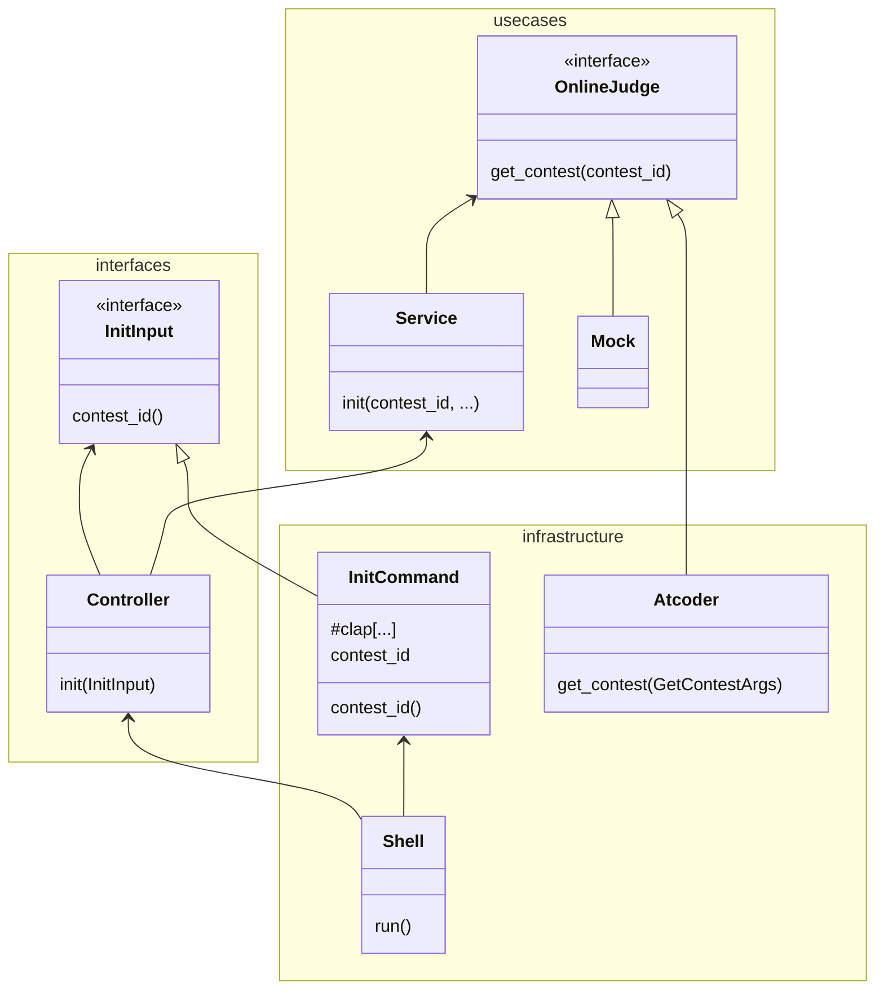

### open workspace

```
$ code ./giming.code-workspace
```


### architecture funniki

```
crates/domain/src
├── entity.rs
├── error.rs
└── lib.rs
crates/usecases/src
├── directory_generator.rs
├── lib.rs
├── online_judge.rs
├── service
│   ├── init.rs
│   ├── login.rs
│   └── whoami.rs
├── service.rs
└── service_error.rs
crates/interfaces/src
├── controller
│   └── input.rs
├── controller.rs
└── lib.rs
crates/infrastructure/src
├── config.rs
├── detail_error.rs
├── directory_generator_impl.rs
├── external
│   ├── atcoder_requester
│   │   └── atcoder_requester_impl.rs
│   └── atcoder_requester.rs
├── external.rs
├── lib.rs
├── online_judge_impl
│   ├── atcoder
│   │   ├── get_problems_detail.rs
│   │   ├── get_problems_summary.rs
│   │   ├── login.rs
│   │   ├── submit.rs
│   │   └── whoami.rs
│   └── atcoder.rs
├── online_judge_impl.rs
├── shell
│   ├── commands.rs
│   ├── init.rs
│   ├── login.rs
│   └── whoami.rs
└── shell.rs
```




