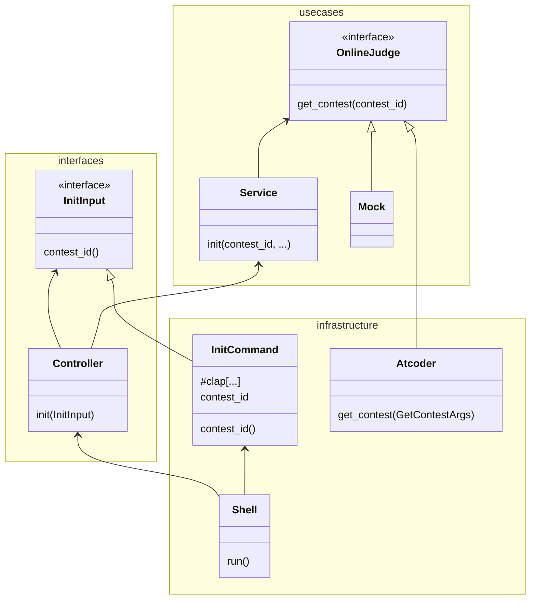

### open workspace

```
$ code ./giming.code-workspace
```


### architecture funniki



```mermaid
classDiagram

  namespace usecases {

    class OnlineJudge {
      <<interface>>
      get_contest(contest_id)
    }

    class Service {
      init(contest_id, ...)
    }

    class MockOnlineJudge["Mock"] {
    }

  }
  OnlineJudge <|-- MockOnlineJudge
  OnlineJudge <-- Service

  namespace interfaces {
    class InitInput {
      <<interface>>
      contest_id()
    }
    class Controller {
      init(InitInput)
    }
  }

  InitInput <-- Controller
  Service <-- Controller

  namespace infrastructure {
    class Shell {
      run()
    }

    class InitCommand {
      #clap[...]
      contest_id
      contest_id()
    }

    class Atcoder {
      get_contest(GetContestArgs)
    }
  }

  Controller <-- Shell
  InitCommand <-- Shell
  InitInput <|-- InitCommand
  OnlineJudge <|-- Atcoder

  
```

